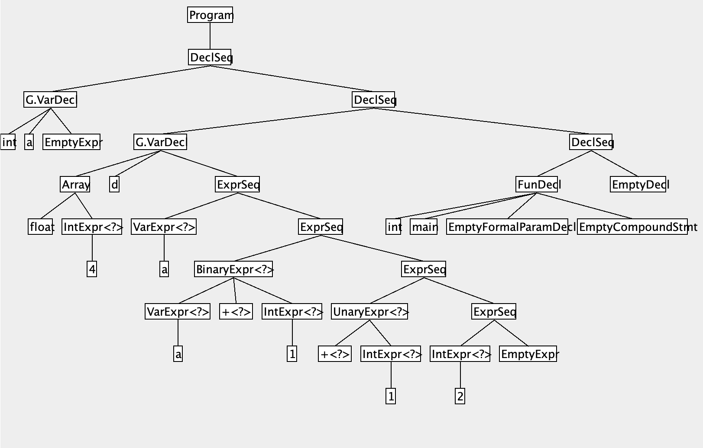

# Mini-C compiler

## Overview
**Mini C** is complete subset of **ANSI C**
> Mini C was devised by reducing several language structures from the existing ANSI C grammar. The overall program structure is similar, but there is only an integer type in the data type, and no structure such as multiple arrangements exists. In addition, bit-related operators were excluded. However, in general, it is thought that there is a great educational effect in designing experimental compilers.

### Code structure of the MiniC compiler
<p align="center">
  
</p>

## Documentation
- [MiniC Language Specification](docs/minic_language_spec.md)
- [Scanner Description](docs/descriptions/scanner_description.md)
- [Parser Description](docs/descriptions/parser_description.md)
- [AST Description](docs/descriptions/ast_generation.md)
- [Static Semantic Analysis](docs/descriptions/static_semantic_analysis.md)

## How to run

```zsh
# build
./gradlew clean
./gradlew build
```


### Scanner
This scanner read a character stream from a MiniC source file and translate it to a sequence of MiniC tokens.
This is known as the lexical analysis part of a compiler.

```zsh
# running and testing scanner
java -jar build/libs/MiniC-Scanner.jar {input-path}

# example
java -jar build/libs/MiniC-Scanner.jar MiniC/Scanner/tst/base/testcases/c1.txt

# redirect the output of scanner to a file
java –jar build/libs/MiniC-Scanner.jar {input-path} > {output-path}
```


### Parser
A recursive descent parser (RD parser) for MiniC.
(only check the syntactic correctness of the input program)

```zsh
# build for parser(Recommended)
./gradlew jarNoScanner

# running and testing parser
java -jar {input-path}

# example
java -jar build/libs/MiniC-Parser.jar MiniC/Parser/tst/base/testcases/c1.txt
```
- jarNoScanner: sacnning with perfect scanner on library 
- jar: scanning with custom scanner


### AST Generation
Extend recursive descent parser to produce Abstract Syntax Trees (ASTs) for MiniC. 
If a program is syntactically legal, then the parser must build the AST for the program. Otherwise the parser can print any error message and exit without completing the AST for the illegal input program.

The MiniC compiler accepts a set of command-line switches:
- -ast to display the AST on-screen.
- -astp to display the AST, including source positions.
- -t <file> prints the AST in file <file>, using the TreePrinter.
- -u <file> unparses the AST into file <file>.

```zsh
# build for AST generation
./gradlew jarNoScanner

# running and testing parser(ast-generation)
java -jar build/libs/MiniC-AstGen.jar -option {input-path} {solution-path}

# check difference between desirable
diff {mytest.mc.u} {mytest.mc.u.u}

# examples
java -jar build/libs/MiniC-AstGen.jar -t MiniC/Parser/tst/base/AST_testcases/c3.mc.u MiniC/Parser/tst/base/AST_testcases/c3.mc

java -jar build/libs/MiniC-AstGen.jar -u MiniC/Parser/tst/base/AST_testcases/c3.mc.u MiniC/Parser/tst/base/AST_testcases/c3.mc

diff MiniC/Parser/tst/base/AST_testcases/c4.mc.u MiniC/Parser/tst/base/AST_testcases/c4.mc.u.u

# drawing AST 
java -jar build/libs/MiniC-AstGen.jar -astp MiniC/Parser/tst/base/AST_testcases/c3.mc.u
```

#### AST Drawing Example
<p align="center">
  
</p>


### Static Semantic Analysis
MiniC static semantic analysis ensures two types of constraints, namely scope rules and type rules.
(check detail consist of two subphases by read [Description](docs/descriptions/static_semantic_analysis.md))

The build tasks "jar" and "jarNoScanner" are the same as with AST generation. Build task **"jarNoScannerNoParser"** has been added

- -ast1 to display the AST from the parser on-screen.
- -ast2 to display the AST from semantic analysis on-screen.
- -envast to display the AST of the MiniC standard environment on-screen.
- -t <file> prints the AST from the parser in file <file>, using the TreePrinter.
- -u <file> unparses the AST from the parser into file <file>.

```zsh
# build for Static Semantic Analysis
./gradlew jarNoScannerNoParser

# running and test commands are similar with AST commands
```


### Code Generation

--- 
### Environment
OS: Mac Ventura  
Language: Java (JDK 17)  
Build: [gradle](https://gradle.org/)  
- Check detail **[About Gradle](docs/about_gradle.md)**