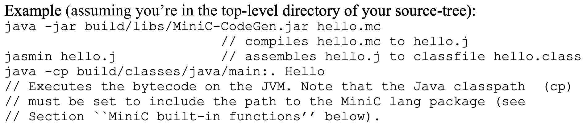
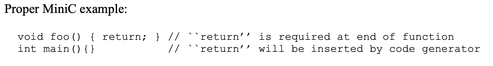

## Code Generation
Code generator will again be a visitor of our AST class hierarchy. A skeleton of this visitor is provided (file Emitter.java). This visitor will traverse the AST and output (emit) Jasmin assembly instructions. The order of AST traversals and the instructions to be emitted are specified by the code templates in the lecture slides on Java bytecode generation. To keep the workload manageable, the visitor provided to you already covers the complete MiniC language, and you will have to fill in your code at specific places. Code generation for arrays and for floating point variables will be left out.

### Specification
As before, if no lexical, syntactic or semantic error is found, the compiler should announce"Compilation was successful.", otherwise it should print "Compilation was unsuccessful." If the MiniC compiler is given input file hello.mc, then the output file will be hello.j. File hello.j will contain the Jasmin assembly code that has been generated for file hello.mc. The Jasmin assembler will assemble hello.j into a classfile named hello.class. The bytecode in hello.class can then be run on the JVM. 

<p align="center">
  
</p>

### Notes on the JVM
Bytecode that runs on the JVM must fulfill the requirements of the JVM specification. Most JVM implementations use a bytecode verifier before they execute bytecode. This bytecode verifier checks that bytecode conforms to the JVM specification. If bytecode violates this specification, the JVM will generate an exception and exit.

The JVM requires that bytecode methods end with a return statement. However, it is not required with MiniC to end a function with a return statement. Moreover, in Java, the main function is of return-type void, whereas the MiniC main function is of return type int. The quickest way to get around this issue is as follows.

(1.) Do not use a return statement in the MiniC main function. Our code generator in Emitter.java will insert a return statement at the end of main for you.
(2.) For all other MiniC functions, you should add proper return statements in the MiniC code.
The code that we will use for marking adheres to the above rules. If your own test cases violate Rule (2) above, the JVM will complain with "falling off the end of the code".

<p align="center">
  
</p>

The JVM requires that all variables are initialized before they are used. For global MiniC variables, a default initialization has already been implemented for you in the class initializer.
For local variables, you should make sure in your MiniC code that variables are initialized before they are used. Note: the code generator skeleton provided to you does not implement variable initializations yet. Therefore you cannot use initializers like
```java
int a = 0;
```

Instead, we have to use
```java
int a;
a = 0;
```

The JVM requires to specify the number of operand stack cells that a method will use. This amount must be specified using the ".limit stack <nr of cells>" directive.

The JVM requires to specify the number of slots required for the local variable array of a method. This number must be provided using the ".limit locals <nr of local variables>". This number includes the "this pointer" of instance methods, the number of parameters of a method, and the number of local variables of the method. 

### The MiniC Built-In Functions
All built-in functions of MiniC have been implemented as static methods in the class **System.java**. Class **System.java** belongs to package lang

### Compiling MiniC Programs to Java Bytecode
The following assumptions have been made for every MiniC program:
1. A MiniC program is compiled as if it was a Java class. The name of that class is the filename of the MiniC program, with the suffix ".mc" removed.
2. All global MiniC variables become class variables (aka "static variables") in the bytecode.
3. All MiniC functions except the main function are compiled to instance methods
4. The MiniC main function is compiled like the following Java main method would be compiled by the javac compiler:

```java
public static void main (String argv[]) {
    Classname mc;
    The original local variable declarations of the MiniC main function
    mc = new Classname();
    The original statements of the MiniC main function
    return;
}
```

Therein "Classname" is the name of the class as defined in Assumption 1. "mc" is an object reference to the class and initialized at the end of the variable declarations. Because every non-main MiniC function is an instance method in bytecode, every function call foo() is assumed to be mc.foo(). It is assumed that main cannot be called recursively. The translation of those changes to the MiniC main function has been implemented in Emitter.java.