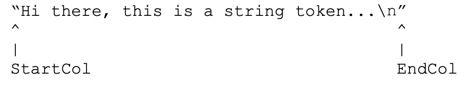
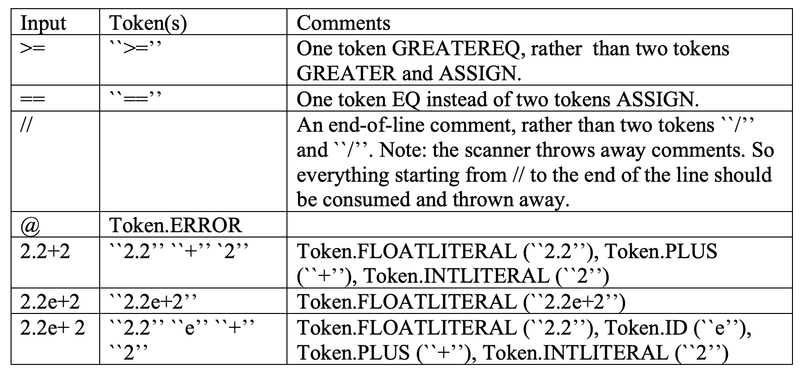

## Scanner

### directory description
- MiniC/MiniC.java: this is the main program (driver) of our MiniC compiler.
- MiniC/Scanner/Scanner.java: a skeleton scanner to be completed by you.
- MiniC/Scanner/Token.java: definitions of all MiniC tokens, and a method for separating keywords from identifiers.
- MiniC/Scanner/SourceFile.java: handling of source files.
- MiniC/Scanner/SourcePos.java: a class to handle source positions (line and column numbers) of tokens.
- build.gradle, gradle, gradlew, gradle.bat, build: files and directories related to the Gradle open-source build automation system, which we use to compile the MiniC compiler (see below instructions on how to compile).
- MiniC/Scanner/tst/base/testcases: several testcases that you can use to test your scanner. You are encouraged to come up with more testcases to test your scanner in every possible way.
- MiniC/Scanner/tst/base/solutions: solutions for the provided testcases.
Your completed scanner shall produce the output as shown in the solutions. Please note that this project gives some freedom with respect to lexical errors (see Section ‘Lexical errors’ below). Testcases containing lexical errors need not correspond byte-by-byte to the provided solutions, as long as they conform to the provided guidelines.
- MiniC/scripts/scannertest.sh: this is a script that you can use to automatically test your scanner. The script will run your scanner on every testcase in the Scanner/tst/base/testcases directory and compare the output to the corresponding solutions in Scanner/tst/base/solutions. Please note: this script is provided to you to help debugging your scanner. The second purpose is to show you how large testing tasks can be automated by scripts.

---

File Token.java defines a class Token, which we use to represent MiniC tokens. For every token in the input stream, your scanner is expected to provide the corresponding Token object. The constructor of the Token class expects three pieces of information:
1. the token kind, represented as an int (e.g., Token.ID, TOKEN.INTLITERAL);
2. the lexeme of the token, represented as a string (e.g., “counter”, “22”)
3. the position of the token in the program. Positions are represented as objects of class
SourcePos.

Class Token makes it easy to distinguish keywords from identifiers: initially the scanner classifies all keywords as identifiers. The constructor of class Token compares the lexeme of the presumptive identifier with the list of MiniC keywords. In case the presumptive identifier is contained in the list of MiniC keywords, the constructor will change the token kind accordingly (see file Token.java).

The class SourcePos from file SourcePos.java contains four instance variables: StartCol, EndCol, StartLine and EndLine. These variables are used to record the position of a token within a MiniC program. In MiniC, line and column numbers start from 1. sVariable StartCol denotes the column where a token starts, variable EndCol denotes the column where a token ends, and StartLine and EndLine denote the line number where the token occurred (Note: in MiniC, no token can span multiple lines, therefore StartLine=EndLine for every token.).

With **string literals**, StartCol and EndCol are set to the occurrences of the enclosing quotes:

  

If a string contains illegal escape sequences (i.e., an escape sequence other than \n), it is up to you to decide on the lexeme for this string (see also the section on lexical errors below).
However, you must set StartCol and EndCol accordingly.
When the end of file is reached, the parser returns an end-of-file token (Token.EOF).
This has already been implemented for you in Scanner.java.

**Error Token**: Token.ERROR is used like all other tokens: its spelling and position is set
according to the input. For example, if the character @ appears in the input, the scanner will
create a Token object using

  new Token (Token.ERROR, “@”, src_pos)

where src_pos specifies the position of character @ in the input.

## Longest match

It is important for our MiniC scanner to always consume the longest possible match (maximal munch). The examples in the following table should point that out.

  

The scanner should discard whitespace and comments. The scanner must always return an object of class Token as defined in file Token.java.

## Lexical errors

A MiniC scanner should detect four kinds of lexical errors:
1. illegal characters, i.e., characters that cannot be part of any token,
2. un-terminated comments,
3. un-terminated strings,
4. illegal escape sequences in strings, for example ``\y’’.