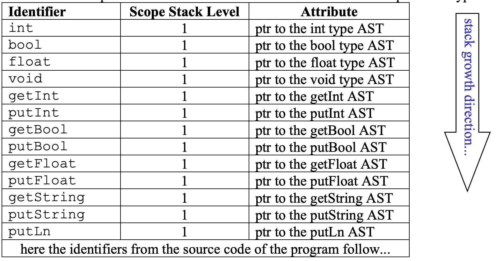
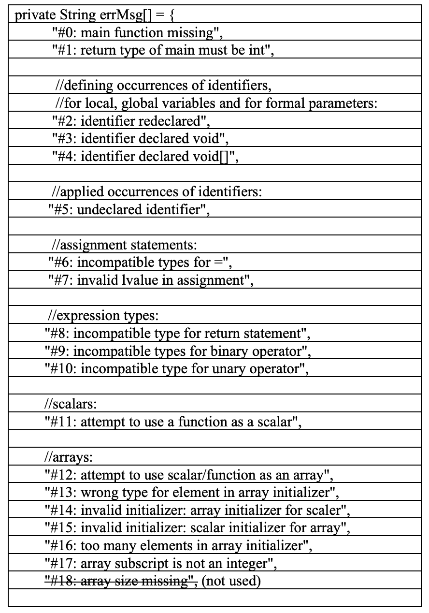
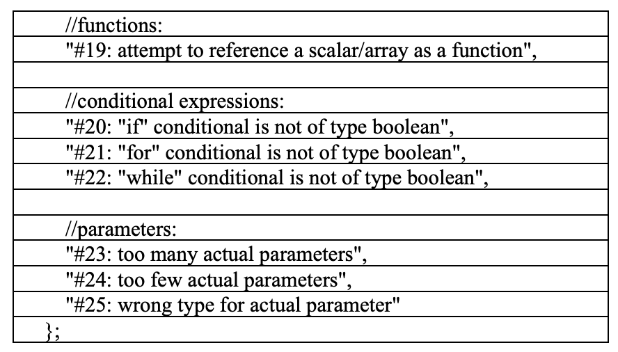

## Static Semantic Analysis

### Specification
MiniC static semantic analysis ensures two types of constraints, namely (1) scope rules and (2) type rules. Therefore static semantic analysis consists of two subphases:

1. Identification: Here we apply the scope rules of MiniC (discussed in the lecture) to relate each applied occurrence of an identifier to its declaration.

2. Type checking: we apply the type rules of MiniC to determine the type of each construct. We compare that the type we have found is compatible to the type that is expected in that context.

This project involves developing a visitor class in file SemanticAnalysis.java that implements the visitor methods from the visitor interface in the file MiniC.AstGen.Visitor.java. Our semantic analyzer is a visitor object that performs type checking and identification while it visits the AST in a depth-first traversal. In case of ill-typed constructs, appropriate error messages must be issued. As before, if no lexical, syntactic or semantic error is found, the compiler should print “Compilation was successful.”, otherwise it should print “Compilation was unsuccessful.”.


### Identification
A scope stack has been implemented. Identification relates each applied occurrence of an identifier to its declaration, by applying the scope rules of MiniC. We use the scope stack to associate identifiers with their declaration. In the MiniC compiler, the identifier’s declaration is represented as a pointer to the AST subtree (FunDecl, VarDecl, or FormalParamDecl) that represents that declaration. This attribute is represented by the instance variable declAST in MiniC.AstGen.ID.java:

```java
public class ID extends Terminal {
    
    public AST declAST;

    public ID (String Lexeme, SourcePos pos) {
        super (pos);
        this.Lexeme = Lexeme;
        declAST = null;
        }

    public void accept(Visitor v) {
        v.visit(this);
    }
}
```

During identification, we use the scope stack to store identifiers and their declarations for later lookup. (We perform look-ups when we encounter applied occurrences of identifiers.)

The scope stack consists of two classes.
1. MiniC.SemanticAnalysis.IdEntry.java is the internal data structure for stack entries of the scope stack.
2. MiniC.SemanticAnalysis.ScopeStack.java defines all methods that the scope stack supports

The scope stack is already pre-loaded with the entries for the Standard Environment of MiniC (many programming languages provide the programmer with a set of pre-defined types, constants and functions that the programmer can use without having to declare them). The MiniC standard environment contains 9 built-in functions and several primitive types. The declarations of these constructs do not appear in the printout of your ASTs, but you can use the MiniC compiler’s –envast option to print the AST of the standard environment. In order to make the use of built-in functions such as putInt() possible from within MiniC programs, the ASTs for those functions and primitive types are constructed in the constructor of package MiniC.StdEnvironment. Before semantic analysis, the semantic analyzer initializes the scope stack with the identifiers for those functions and primitive types.


<p align="center">
  
</p>

### Error Messages
Semantic errors must be reported to the user. The file **SemanticAnalysis.java contains** predefined error messages that you should use.

<p align="center">
  
</p>
<p align="center">
  
</p>

