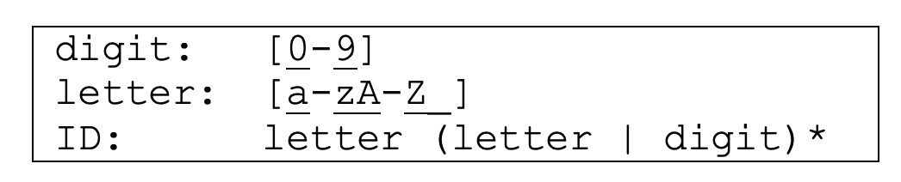
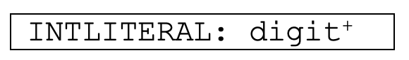
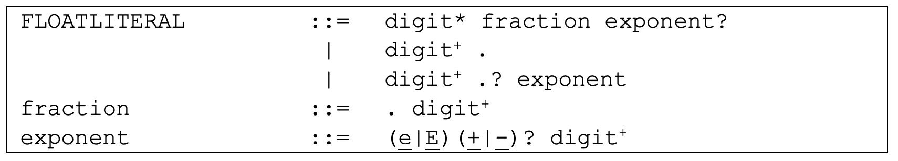
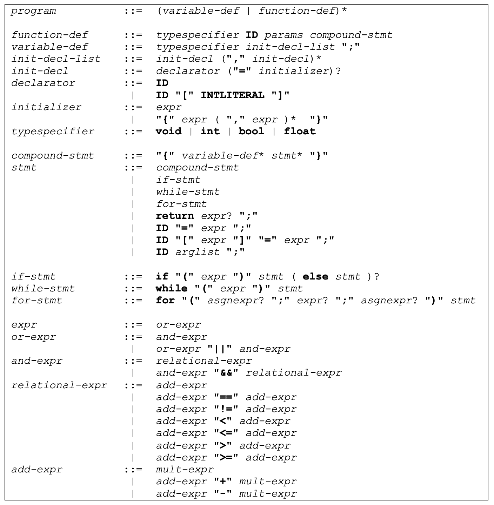
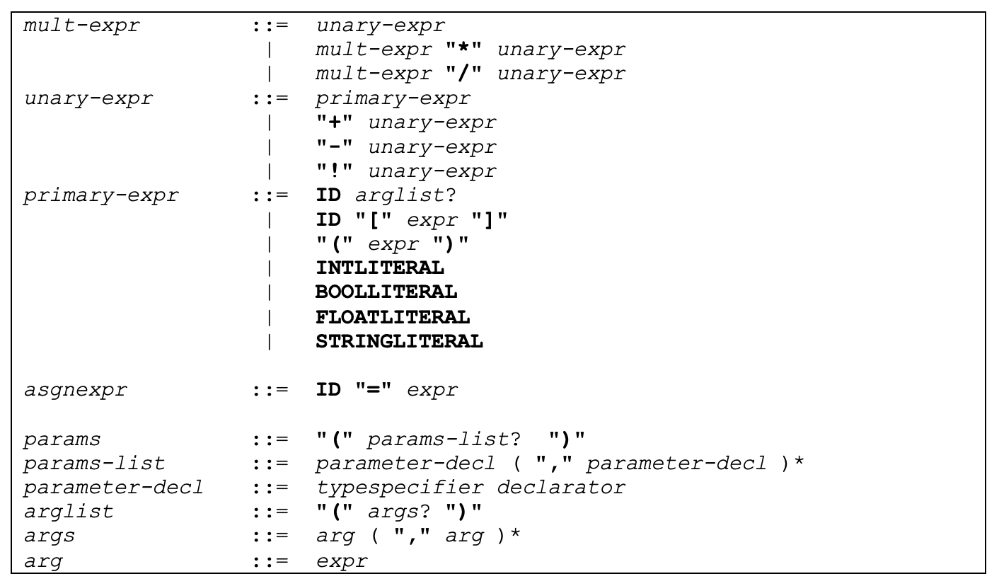

# MiniC Language Specification

## Lexical Structure of MiniC
This section defines the character set, token set and the comment conventions of the MiniC programming language.

#### Character Set
MiniC programs consist of ASCII characters. Blank (ASCII 0x20), tab (ASCII 0x09), formfeed (ASCII FF 0x0C), carriage return (ASCII CR 0x0D) and newline (ASCII LF 0x0A) are whitespace characters. Lines are terminated by ASCII LF or CR+LF. The two characters CR+LF are counted as one line terminator, not two. Line terminators are ignored except that they delimit tokens or terminate an end-of-line comment. The number of line terminators read so far are used to determine line numbers in MiniC compilers.

#### Tokens
MiniC consists of five token kinds: keywords, identifiers, operators, separators and literals.

#### Identifiers
Identifiers (ID) start with a letter or an underscore, followed by zero or more letters, digits or
underscores. MiniC is case-sensitive; two identifiers that differ only in case are considered
distinct (e.g., “counter” and “Counter”).

  

Note that according to the regular expression for ID, sequences of underscores are valid
identifiers (e.g., “_”, “__”, “___”).

#### Keywords
MiniC provides the following character sequences as keywords. Keywords are reserved,
which means that they cannot be used as identifiers.

  <b>bool else for float if int return void while</b>

#### Operators
|       Category       |     Tokens      |
|----------------------|-----------------|
| Arithmetic operators |      + - * /    |
| Relational operators | < <= > >= == != |
| Logical operators    |      && || !    |
| Assignment operator  |        =        |

In the above table, “!” is the unary logical “not” (complement) operator and “+” and “-“ are
overloaded to represent unary and binary plus and minus.

#### Separators
The following characters are separators:

  <b>{ } ( ) [ ] , ;</b>

#### Literals
A literal represents a value of type int, float, bool, or string. Integer literals are specified in
base 10 (decimal) and consist of at least one digit:

  

Floating-point literals consist of the following parts: a whole-number part, a decimal point
(“.”), a fractional part and an exponent. Exponents are indicated by “e” or “E” followed by
an integer (with optional sign). At least one digit in either the whole-number part or the
fractional part, and either a decimal point or an exponent are required. All other parts are
optional.

  

The following literals are examples of floating-point literals:

  <b>2.3  4.  .4  2e2  2E4  2.2E+2  2.4e-2  .1E3</b>

A Boolean literal is one of the character sequences **true** or **false**. Boolean literals cannot be
used as identifiers.  

String literals consist of zero or more characters surrounded by double quotes. Quotes delimit
the string, but they are not part of it. MiniC strings may contain the escape sequence “\n”
(newline). String literals must not extend to the next line, i.e., it is a compile-time error if a
newline character (not to be mistaken with the newline escape sequence \n) appears after
the opening quote (“) and before the closing quote of a string.

#### Comments
MiniC provides two kinds of comments:
- End-of-line comments: // ....
  All the text from // to the end of the line is ignored (as with C++ and Java).
- C-style comments: /* ... */
  All text, from and including /* and */ is ignored.  

According to C, C++ and Java, the following rules apply to comments:
1. Comments do not nest: /* /* */ */ will not work, because after the first occurrence of */ the comment is considered to be terminated.
2. /* and */ have no special meaning in comments that begin with //.
3. // has no special meaning in comments that begin with /*.

## MiniC Grammar
In this section we introduce the syntax of MiniC using a context-free grammar (CFG). We use Extended Backus-Naur Form (EBNF), which is Backus-Naur Form (BNF) plus regular expressions. (EBNF and BNF will be introduced in the lectures on Syntax Analysis.)
Like regular expressions, a CFG specifies a language. CFGs consist of a number of productions. Each production has a non-terminal symbol on its left-hand side, and a sequence of one or more non-terminal or terminal symbols on its right-hand side. The left-hand side of
the first production is the start symbol.  

The language specified by a CFG consists of sequences of terminal symbols.
Sequences of terminal symbols are generated by derivations: starting from the start symbol, we repeatedly replace a non-terminal with the right-hand side of a production, for which the non-terminal is the left-hand side.  

In the following grammar, non-terminals are printed in italic. Non-terminals are introduced by the non-terminal being defined, followed by ::=, followed by the right-hand side of the production. Terminals are represented by a sequence of bold-face characters, (e.g., return).
Terminals may be surrounded by quotes (e.g., “<=”, to clearly separate them from the surrounding text[1](#footnote_1).
We use iteration constructs from regular expressions, i.e., ?, * and + to denote multiple occurrences of a symbol:

S? denotes zero or one occurrence of S
S* denotes zero or more occurrences of S
S+ denotes one or more occurrences of S
We use parentheses to apply iteration constructs to a group of symbols, e.g., (S T)?.

  

  

--- 
<a name="footnote_1">1</a>) Similar to regular expressions, where we use underlining to mark characters from the alphabet ∑. 